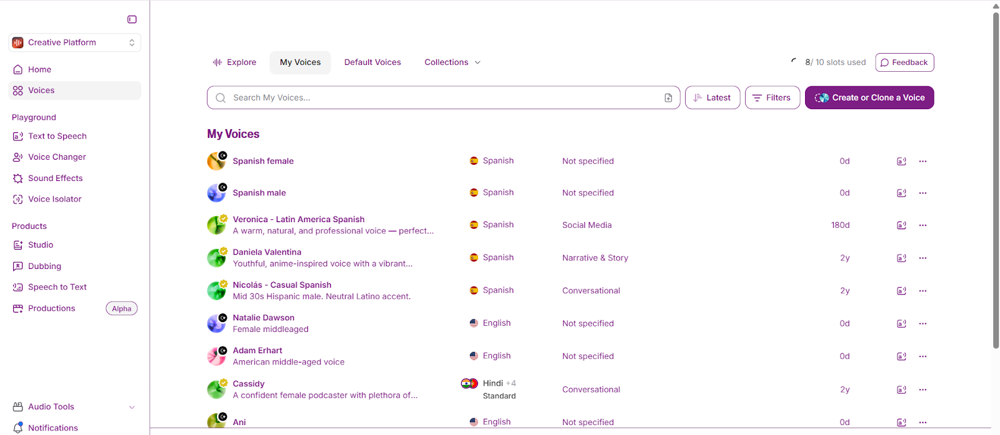
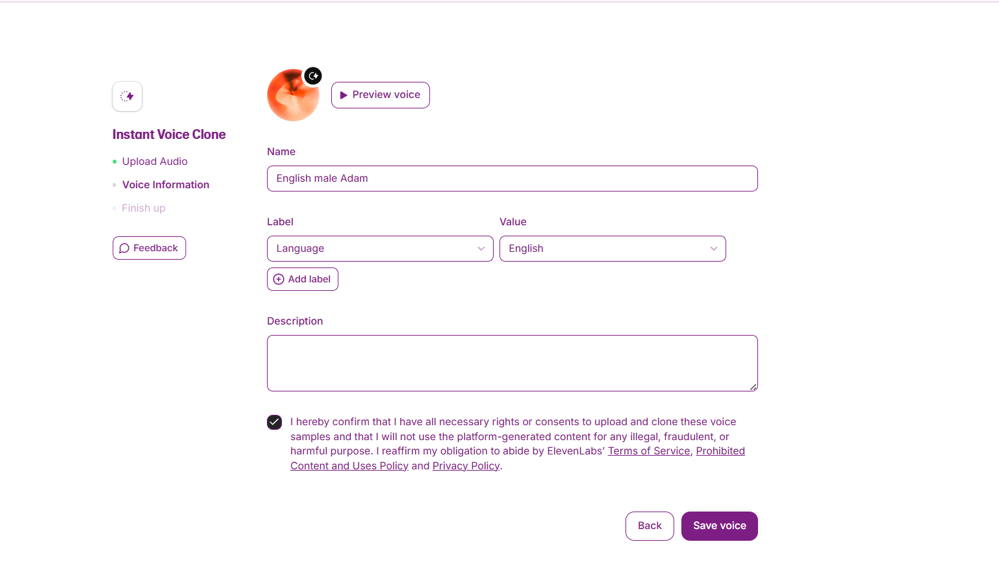

# 🗣️ CloneVoice – AI-Powered Voice Cloning Tool

**CloneVoice** is an AI-powered tool that makes **voice cloning simple and scalable**.  
With just **1–5 minutes of audio**, it captures **tone, cadence, and emotion** to generate **natural, human-like speech from text**.

Supporting both **real-time** and **batch processing**, CloneVoice is perfect for:
- 🎙️ Podcasts
- 📚 Audiobooks
- 🤖 Virtual Assistants
- ♿ Accessibility Tools

---

## 🎬 Examples & Demo

<table>
    <tbody>
        <tr>
            <td>
                
            </td>
            <td>
                
            </td>
        </tr>
        <tr>
            <td>
                
            </td>
            <td>
                
            </td>
        </tr>
    </tbody>
</table>

<video src="https://github.com/user-attachments/assets/e1c3f17a-30af-4448-b11c-57309c440c6d" controls preload>
    Your browser does not support the video tag.
</video>

<table>
    <tbody>
        <tr>
            <td>
                <audio controls>
                  <source src="https://github.com/user-attachments/files/21934776/Adam_Erhart_cloned.mp3">
                    Your browser does not support the audio element.
                </audio>
            </td>
            <td>
                <audio controls>
                  <source src="" type="audio/mp3">
                    Your browser does not support the audio element.
                </audio>
            </td>
        </tr>
        <tr>
            <td>
                <audio controls>
                  <source src="" type="audio/mp3">
                    Your browser does not support the audio element.
                </audio>
            </td>
            <td>
                <audio controls>
                  <source src="" type="audio/mp3">
                    Your browser does not support the audio element.
                </audio>
            </td>
        </tr>
    </tbody>
</table>

---

## 📝 Full Description

**CloneVoice** replicates **individual voice traits** such as **tone, cadence, and emotional range**.  
It enables **fast and scalable** production of **realistic speech**, making it a versatile tool for **creators and businesses**.

---

## ⚠️ Problem Statement

Conventional text-to-speech systems often:  
❌ Require large datasets  
❌ Produce robotic, synthetic voices  
❌ Lack flexibility & emotional expression

There was a need for a **low-data, customizable solution** that delivers **high-fidelity voice replication**.

---

## 💡 Solution

CloneVoice solves these challenges with:

- 🎤 **Voice cloning from just 1–5 minutes of audio**
- 🎭 **Captures emotional tone & natural prosody**
- ⚡ **Real-time inference & batch processing**
- 🛠️ **API + local deployment options**

---

## 🛠️ Process

### 🔹 Preprocessing
- Noise reduction & silence trimming
- Volume normalization
- Resampling (22.05 kHz)
- Phoneme alignment

### 🔹 Model Stack
| Component         | Model         | Purpose |
|------------------|--------------|---------|
| **Speaker Encoder** | d-vector     | Extracts unique voiceprints |
| **Synthesizer**     | Tacotron 2   | Converts text + embeddings → mel-spectrogram |
| **Vocoder**         | HiFi-GAN     | High-quality speech waveform generation |

### 🔹 Training & Validation
- Dataset: 500+ multilingual speakers
- Few-shot learning for **low-data cloning**
- Validation with noisy & unseen voices

### 🔹 Evaluation Metrics
- ⭐ **MOS (Naturalness):** 4.3/5
- 👤 **Speaker Similarity:** 92%
- 📝 **WER:** <5%
- ⚡ **Inference Speed:** Sub-second (real-time)

---

## 🏆 Achievements

✅ High-fidelity cloning from as little as **2 minutes of audio**  
✅ Real-time voice synthesis with **low latency**  
✅ Applied in **audiobooks, chatbots, and accessibility tools**  
✅ **Higher speaker fidelity** vs commercial tools

---

## 🔮 Future Enhancements

- 🌍 Multilingual voice transfer
- 🎭 Emotion control (adjust pitch, tone, mood)
- 🔐 Voiceprint watermarking for security
- 🛠️ Interactive editor for fine-tuning

---

## 📚 References

1. Wang et al., *Tacotron 2: Generating Human-like Speech from Text* (2017)
2. Kong et al., *HiFi-GAN: Generative Adversarial Networks for Efficient and High Fidelity Speech Synthesis* (2020)
3. Arik et al., *Voice Cloning for Everyone* (2018)
4. Mozilla TTS & Descript Lyrebird API (baseline comparison)

---
